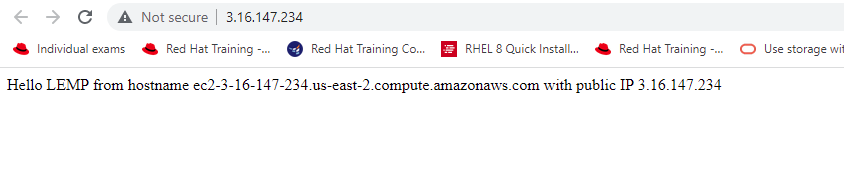
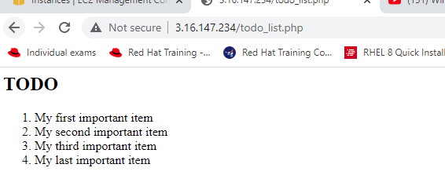

# Documentation for Project 2 -- WEB STACK IMPLEMENTATION (LEMP STACK)

## STEP 1 -- installing nginx webserver and nginx package `

` sudo apt update && sudo apt install nginx  -y `

` sudo systemctl status nginx `

* checking port 80 on my local host` 

` curl http://127.0.0.1:80  or curl http://localhost:80 `
* checking nginx server on my web browser `

* http://13.59.202.17:80 `

## STEP 2 -- installing mysql database and loging into mysql 

` sudo apt install mysql-server -y  ` 

` sudo mysql `

` securing my mysql root access password `

* setting mysql root passoword `

` ALTER USER 'root'@'localhost' IDENTIFIED WITH mysql_native_password BY 'PassWord.1'; `

` sudo mysql_secure_installation `

` sudo mysql -p `

*  STEP 3 -- installing php and its dependencies`

` sudo apt install php-fpm php-mysql -y `
## STEP 4 -- CONFIGURING NGINX TO USE PHP PROCESSOR 

* creating a dir projectLEMP and changing owership 

` sudo mkdir /var/www/projectLEMP && sudo chown -R $USER:$USER /var/www/projectLEMP ` 

` sudo vi /etc/nginx/sites-available/projectLEMP `

` Activating config `

` sudo ln -s /etc/nginx/sites-available/projectLEMP /etc/nginx/sites-enabled/ `

` sudo nginx -t `

* disabling default nginx host ` 

` sudo unlink /etc/nginx/sites-enabled/default`

*  uting content in the new web site `

` sudo echo 'Hello LEMP from hostname' $(curl -s http://169.254.169.254/latest/meta-data/public-hostname) 'with public IP' $(curl -s http://169.254.169.254/latest/meta-data/public-ipv4) > /var/www/projectLEMP/index.html`

* nginx testing landing page` 

## STEP 5 -- Testing PHP with nginx `

` sudo vi /var/www/projectLEMP/info.php  ands put php content below `

` <?php
phpinfo();  save and exit ` 

* display the content by  http://http://3.16.147.234/info.php `

 

 *  removing the php sensitive data `

 ` sudo rm /var/www/your_domain/info.php `

## STEP 6 -- RETRIEVING DATA FROM MYSQL DATABASE WITH PHP `

 * conecting into mysql database `

 ` sudo mysql -p , Password=PassWord.1` 

 * creating database named babadeen `

 ` CREATE DATABASE `babadeen`; `

 *  creating a new user ` 

 ` CREATE USER 'example_user'@'%' IDENTIFIED WITH mysql_native_password BY 'PassWord.1'; `

 *  granting example_user full privilege access to babadeen datatbase `

 ` GRANT ALL ON babadeen.* TO 'example_user'@'%'; `

 * testing the new access `

 ` mysql -u example_user -p ` 

 

*  display output for database ` 

 ` SHOW DATABASES; ` 

 

 ` # creating to do list `

 ` CREATE TABLE babadeen.todo_list (
  item_id INT AUTO_INCREMENT,
  content VARCHAR(255),
  PRIMARY KEY(item_id)
  ); `

* inserting values ` 

` INSERT INTO babadeen.todo_list (content) VALUES ("My first important item"); `

*  I ran the above command  3 more times to create more items on the tables and ran below command to select from the table already created above `

` SELECT * FROM babadeen.todo_list; `

*  creating a script to connect to mysql database and query the content in it `

` vi /var/www/projectLEMP/todo_list.php  and copy and past the below script `

  ` <?php
$user = "example_user";
$password = "PassWord.1";
$database = "babadeen";
$table = "todo_list"; 

try {
  $db = new PDO("mysql:host=localhost;dbname=$database", $user, $password);
  echo "<h2>TODO</h2><ol>";
  foreach($db->query("SELECT content FROM $table") as $row) {
    echo "<li>" . $row['content'] . "</li>";
  }
  echo "</ol>";
} catch (PDOException $e) {
    print "Error!: " . $e->getMessage() . " ";
    die();
} 
` 

` # checking the web site with public dns address >> http://http://3.16.147.234/todo_list.php `

